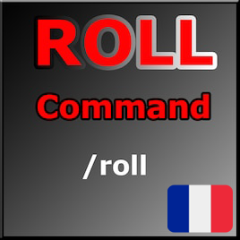
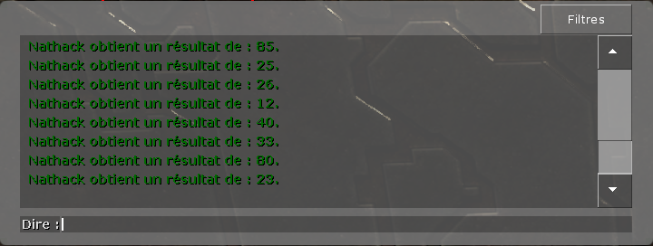

<br />
<div align="center">
  <a href="https://github.com/nathack-dev/gmod-rp-roll">
    
  </a>

  <h3 align="center">Commande de Roll</h3>

  <p align="center">
Cette addon sert à augmenter le niveau de roleplay sur vos serveurs.
    
<br/>
</div>

## 📷 Images 
<div align="center">
  <a href="https://github.com/nathack-dev/gmod-rp-roll">
    
  </a>
</div>

## ⚙️ How-To setup 
- Dans la racine /addons
- Crée un nouveau fichier nomée "roll"
- Glissez-y le fichier lua
 
 ## 📚 Fonctions utiles 
 ```lua
ROLLCONF = { 
tchatmsg = " obtient un résultat de : ",
cmd = "roll"
}
```

Dans `sh_roll`, vous pouvez remplacer dans `tchatmsg` le message obtenu lors de l'exécution de la commande.           
⚠️ Laisser le vide après le guillemet, le joueur qui aurait exécuté la commande apparéteras dans ce vide.

 ```lua
DarkRP.declareChatCommand{
	command = conf.cmd,
	description = "write an roll",
	delay = 1.5
}
```
Dans le `sv_roll.lua`, vous à pouvez remplacer :      
▶️ `description` - Qui va servir à donner la description de la commande `/roll`
▶️ `delay` - Fonction qui va définir le délai que le joueur doit attendre avec de refaire la commande.
